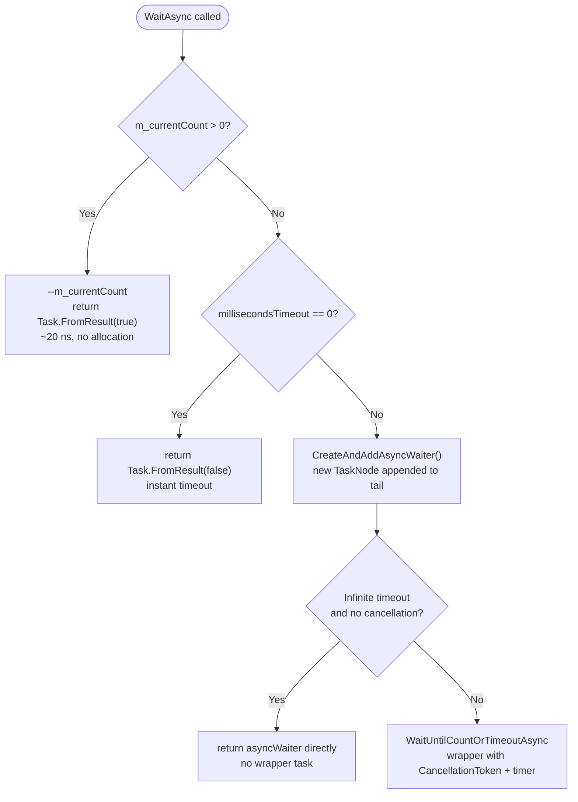
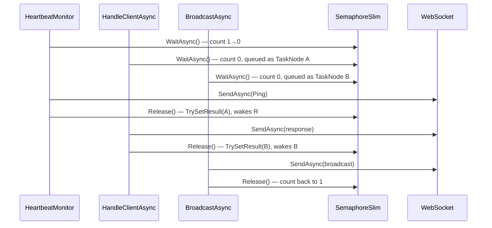
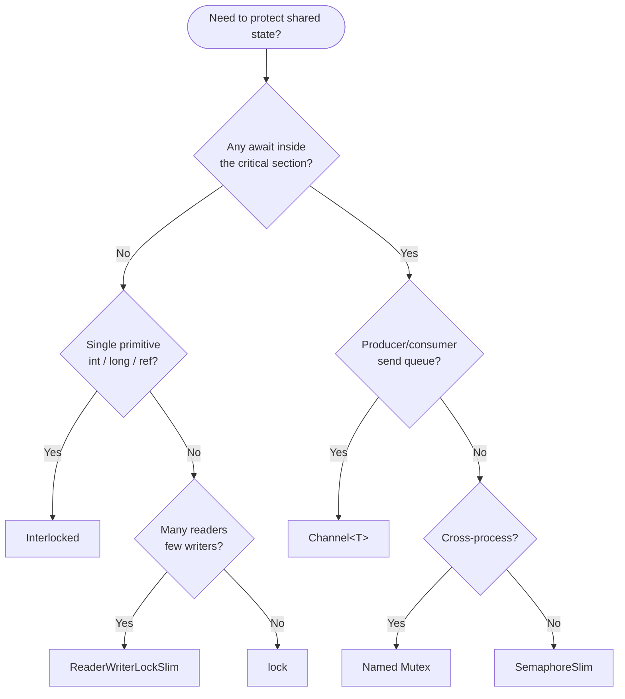

# SemaphoreSlim Deep Dive

*Companion to `docs/WebSocketArchitecture.md` — explains why `SemaphoreSlim(1,1)` is the
right per-socket send lock in the Tennis Club server.*

---

## 1. The Problem It Solves

Three independent code paths can call `WebSocket.SendAsync` on the **same socket** at the
same time:

| Writer | Trigger |
|---|---|
| `HandleClientAsync` | Sending a booking/availability response |
| `HeartbeatMonitor.SendPingAsync` | Every 10 seconds |
| `ConnectionManager.BroadcastAsync` | After every booking — notifies all clients |

`WebSocket.SendAsync` is **not thread-safe**. Calling it concurrently on one instance throws
`InvalidOperationException`. We need a lock that:

1. Works inside `async`/`await` — `lock` with `await` inside is a **CS1996 compile error**.
2. Is **not thread-affine** — acquire on one thread, release on another (the continuation may
   resume on a different thread-pool thread).
3. Has minimal overhead — a socket send lock is held for microseconds.

`SemaphoreSlim(1,1)` satisfies all three requirements.

---

## 2. Why `SemaphoreSlim` Wins — Alternative by Alternative

### `lock` / `Monitor`

```csharp
lock (_sendLock)
{
    await ws.SendAsync(...); // CS1996: cannot await inside a lock
}
```

`lock` is syntactic sugar for `Monitor.Enter`/`Monitor.Exit`. The CLR requires the **same
thread** to call both. An `await` inside a `lock` is a compile error because the
continuation may resume on a different thread.

### `Mutex`

Thread-affine (same thread must release), kernel-mode (each acquire/release crosses the
user/kernel boundary), no `WaitAsync`. Wrong tool.

### `Semaphore` (the non-`Slim` version)

Kernel-mode, no `WaitAsync`, Windows-only. Wrong tool.

### `SpinLock`

Busy-waits (burns CPU), thread-affine, no `WaitAsync`. Wrong tool.

### `ReaderWriterLockSlim`

Designed for many-readers / single-writer scenarios. Has no `WaitAsync`. Wrong tool for a
pure-write mutex.

### `Interlocked`

Only works on primitives (`int`, `long`, references). Cannot protect an async operation
spanning multiple statements. Used correctly in `HeartbeatMonitor` for `long _lastPongTicks`
— the right tool **there**, wrong tool here.

### Summary Table

| Mechanism | `await` inside | Thread-affine | Kernel-mode | Per-socket |
|---|---|---|---|---|
| `lock` | ❌ CS1996 | ✅ | ❌ | ✅ |
| `Mutex` | ❌ | ✅ | ✅ | ✅ |
| `Semaphore` | ❌ | ❌ | ✅ | ✅ |
| `SpinLock` | ❌ | ✅ | ❌ | ✅ |
| `ReaderWriterLockSlim` | ❌ | ✅ | ❌ | ✅ |
| `Interlocked` | N/A | ❌ | ❌ | primitives only |
| **`SemaphoreSlim`** | **✅ `WaitAsync`** | **❌** | **❌** | **✅** |

---

## 3. How It Works Internally

### Key Fields

```csharp
private volatile int m_currentCount;              // available permits
private readonly int m_maxCount;                  // upper bound
private int m_waitCount;                          // sync waiters in Monitor.Wait
private int m_countOfWaitersPulsedToWake;
private readonly StrongBox<bool> m_lockObjAndDisposed; // lock object AND disposed flag
private TaskNode? m_asyncHead;                    // head of async waiter queue
private TaskNode? m_asyncTail;                    // tail of async waiter queue
```

`StrongBox<bool>` carries two responsibilities in one allocation: it is the `Monitor` lock
object **and** the disposed flag (`Value = true` when disposed).

### `WaitAsync` — Fast Path vs. Slow Path



The fast path (count > 0) is lock-free and allocation-free. The slow path allocates exactly
one `TaskNode`.

### The Async Waiter Queue

Waiters are stored in a doubly-linked list of `TaskNode` objects. `TaskNode` extends
`Task<bool>` directly — no wrapper needed.


`Release()` calls `TrySetResult(true)` on the **head** node (FIFO), removes it from the
list, and decrements the count. The task's awaiting continuation is scheduled on the thread
pool.

### `TaskCreationOptions.RunContinuationsAsynchronously`

```csharp
private sealed class TaskNode : Task<bool>
{
    internal TaskNode() : base(null, TaskCreationOptions.RunContinuationsAsynchronously) { }
}
```

Without this flag, `TrySetResult` would **synchronously** run all continuations on the
`Release()` caller's thread — while that thread still holds the socket. This causes
re-entrancy bugs and latency spikes. The flag forces continuations onto the thread pool.

### 3-Writer Sequence (Typical Race)



---

## 4. When NOT to Use `SemaphoreSlim`

| Situation | Better choice | Why |
|---|---|---|
| Sync-only critical section (no `await`) | `lock` | Simpler, zero allocation, JIT-optimised |
| Single `int` / `long` / reference flag | `Interlocked` | Lock-free, single instruction |
| Many readers, occasional writers | `ReaderWriterLockSlim` | Readers don't block each other |
| Serial send queue | `Channel<T>` | Eliminates locking — producer enqueues, one consumer dequeues |
| Cross-process mutual exclusion | Named `Mutex` | Only primitive with a name visible across processes |
| Re-entrant locking | `lock` | `SemaphoreSlim` is **not re-entrant** — double-`WaitAsync` deadlocks |

### The `Channel<T>` Alternative

For a per-socket send queue the idiomatic modern pattern is:

```csharp
private readonly Channel<ArraySegment<byte>> _sendChannel =
    Channel.CreateUnbounded<ArraySegment<byte>>();

// Any writer (no lock needed):
await _sendChannel.Writer.WriteAsync(message);

// Single consumer loop:
await foreach (var msg in _sendChannel.Reader.ReadAllAsync(ct))
    await _ws.SendAsync(msg, WebSocketMessageType.Text, true, ct);
```

No lock, no contention, naturally serialised. Tradeoff: slightly higher memory and a
persistent background loop per socket.

---

## 5. Decision Flowchart



---

## 6. Quick Reference

| Feature | `lock` | `Mutex` | `SemaphoreSlim` | `Channel<T>` |
|---|---|---|---|---|
| `await` inside | ❌ CS1996 | ❌ | ✅ `WaitAsync` | ✅ |
| Thread-affine release | ✅ | ✅ | ❌ | N/A |
| Kernel-mode | ❌ | ✅ | ❌ | ❌ |
| Cross-process | ❌ | ✅ | ❌ | ❌ |
| Re-entrant | ✅ | ✅ | ❌ | N/A |
| Permits > 1 | ❌ | ❌ | ✅ | N/A |
| Allocation (uncontended) | 0 | 0 | 0 | 0 |
| Allocation (contended) | 0 | 0 | 1 `TaskNode` | per message |

---

*See also: `docs/WebSocketArchitecture.md` §12 for how `SemaphoreSlim` is wired into the
heartbeat and broadcast paths.*
